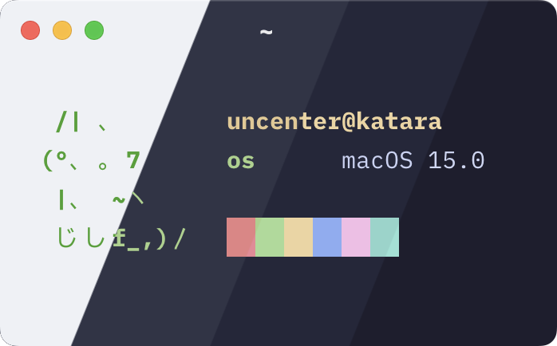
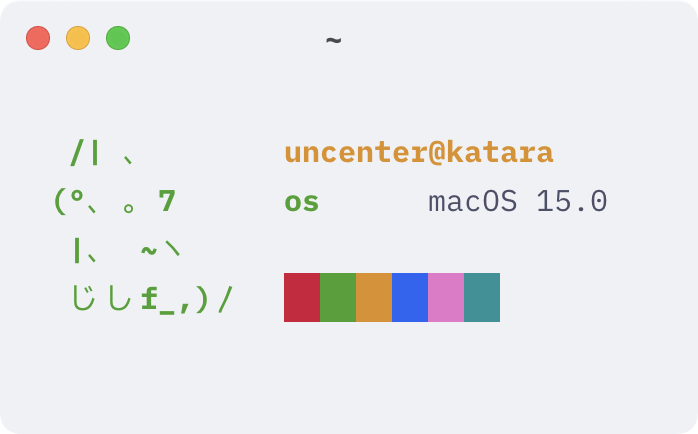
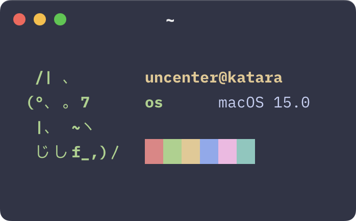
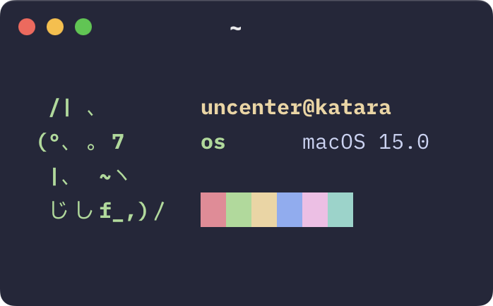
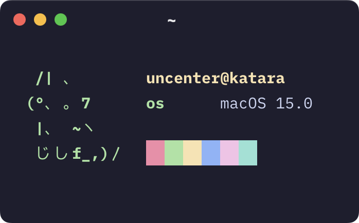

<h3 align="center">
	 
	
	Catppuccin for <a href="https://github.com/ghostty-org">Ghostty</a>
	
</h3>

	
	
	

	

## Previews

🌻 Latte

🪴 Frappé

🌺 Macchiato

🌿 Mocha

## Usage

Catppuccin is included in [mbadolato/iTerm2-Color-Schemes](https://github.com/mbadolato/iTerm2-Color-Schemes), which Ghostty uses for the default themes. Set `theme = catppuccin-<flavor>` in your [Ghostty configuration file](https://github.com/ghostty-org/ghostty#configuration), where `<flavor>` is one of `latte`, `frappe`, `macchiato`, or `mocha`.

Alternatively, you can manually import the themes from this repository by following the instructions below:

1. Copy the contents of your flavor of choice from [`themes/`](./themes/) to your [Ghostty configuration file](https://github.com/ghostty-org/ghostty#configuration).
2. Reload or restart Ghostty.

## 💝 Thanks to

- [uncenter](https://github.com/uncenter)

&nbsp;

	

	Copyright &copy; 2021-present <a href="https://github.com/catppuccin" target="_blank">Catppuccin Org</a>

	

